# Gabarit de `RAPPORT.md`

> 📄 **Mode d'emploi** : copie le contenu ci dessous dans un fichier `RAPPORT.md` **à la racine de ton dépôt**, puis remplis le au fil de l'eau. Ne laisse aucune section vide : si quelque chose n'a pas été fait, écris le et dis pourquoi. Un manque assumé coûte moins cher qu'un manque caché.
>
> Les mentions entre chevrons `<...>` sont à remplacer. Les appels de captures s'écrivent comme dans l'exemple, pour que les images s'affichent sur GitHub.

---

```markdown
# Projet DevOps · velos-api

**Nom et prénom :** <...>
**Groupe :** <M2DAT26.1 ou M2DAN26.1>
**Dépôt :** <lien de ton dépôt GitHub>
**Image publiée :** <adresse de ton image sur le registre>
**Date de rendu :** 28/08/2026

---

## 1. Ce que j'ai construit, en cinq lignes

<Décris la chaîne complète, comme si tu l'expliquais à un collègue qui arrive sur le projet.>

## 2. Le trajet d'une requête

<Décris, en quelques lignes ou par un schéma, le trajet complet d'une requête depuis ton navigateur jusqu'à la base de données, quand l'application tourne dans le cluster. Nomme chaque maillon traversé.>

---

## 3. Jalon 1 · Git

**Ce que j'ai fait :** <...>

**Le conflit :** <sur quel fichier, quelles étaient les deux versions en présence, comment tu as tranché et pourquoi>

**Ce que je retiens :** <...>

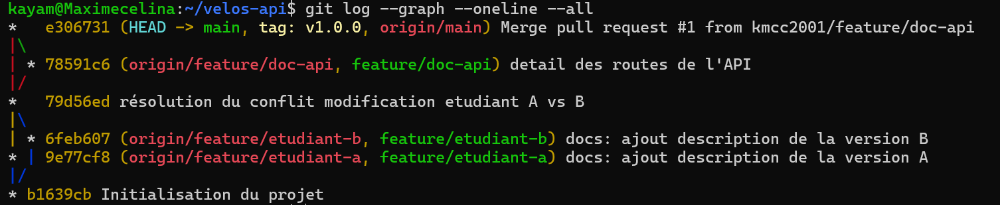
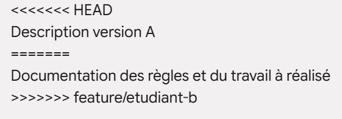
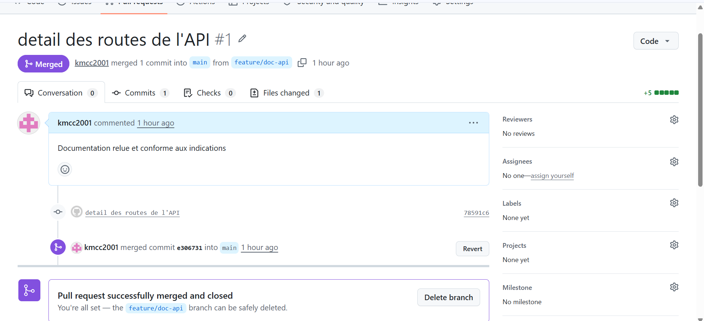
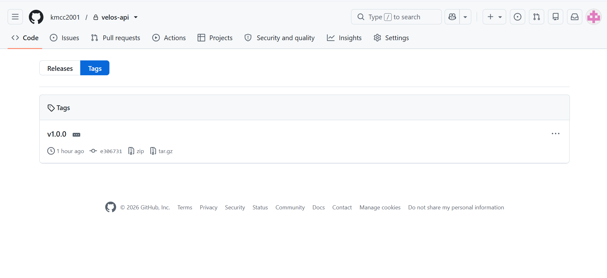
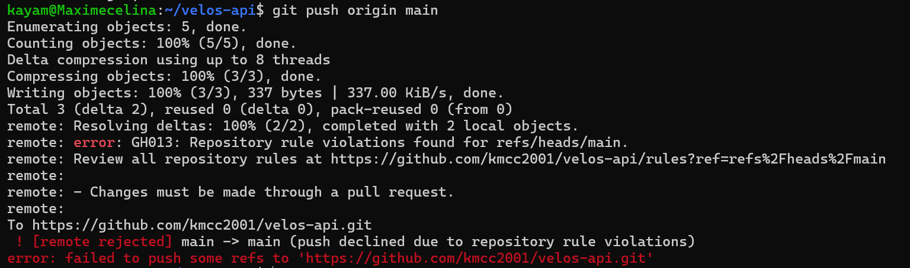

---

## 4. Jalon 2 · Docker

**Mesure du cache de construction**

| Situation | Durée mesurée |
| --- | --- |
| Construction avec les dépendances copiées après le code | <...> |
| Construction avec les dépendances installées avant le code | <...> |

**Taille de l'image**

| Version | Taille |
| --- | --- |
| Version naïve, un seul étage | <...> |
| Version finale, plusieurs étages | <...> |

**Ce que le fichier d'exclusion de construction évite d'envoyer :** <...>

**Comment j'ai prouvé la persistance :** <...>

**Ce que je retiens :** <...>

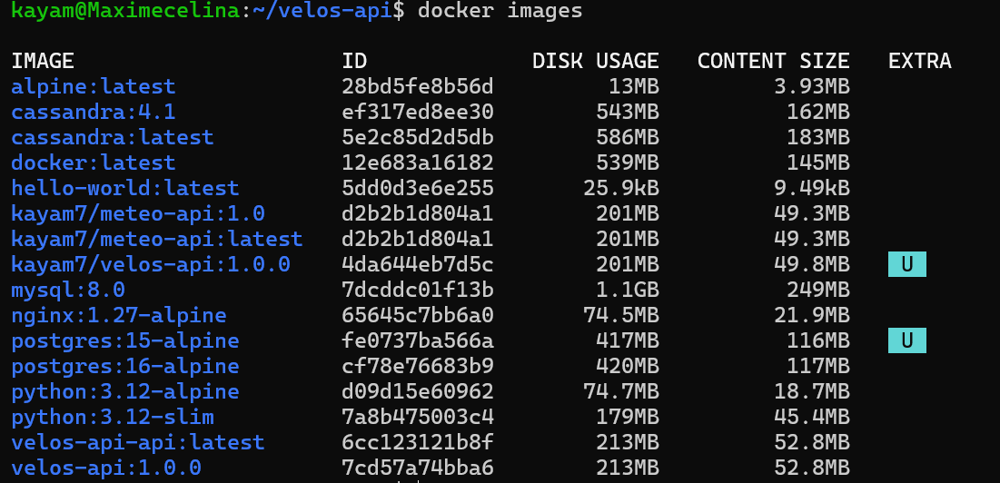
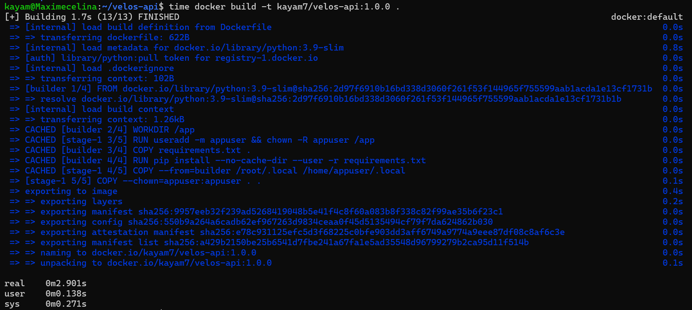
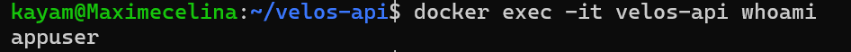
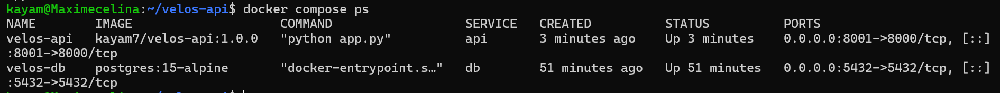
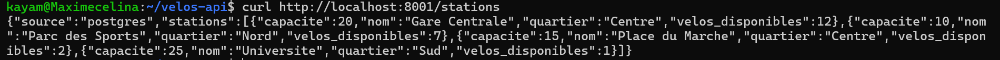
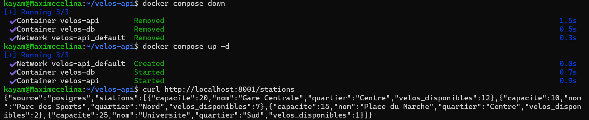

---

## 5. Jalon 3 · Kubernetes

**Comment j'ai obtenu le port 8081 vers le cluster :** <...>

**Où vit le mot de passe, et pourquoi ce n'est pas un coffre-fort :** <...>

**Ce que j'ai observé en supprimant un exemplaire sous trafic :** <...>

**La mise à jour vers la version 2 :** <ce que tu as vu côté client pendant l'opération>

**Le retour arrière :** <...>

**Ce que je retiens :** <...>


---

## 6. Jalon 4 · Jenkins

**Mes tests :** <ce qu'ils vérifient, et pourquoi ils n'ont besoin d'aucune base de données>

**Les quatre étapes de mon pipeline :** <...>

**Comment mes images sont étiquetées, et pourquoi :** <...>

**La ligne qui rend mon pipeline honnête :** <cite la, et dis ce qu'il se passerait sans elle>

**Le rouge utile :** <ce que tu as cassé, ce que le pipeline a refusé de faire, et ce qui tournait encore dans le cluster pendant ce temps>

**L'extrait de journal qui donne la cause :**

<colle ici les quelques lignes utiles, pas le journal entier>

**Ce que je retiens :** <...>


---

## 7. Mes trois difficultés

| # | Symptôme observé | Cause réelle | Correction apportée |
| --- | --- | --- | --- |
| 1 | <...> | <...> | <...> |
| 2 | <...> | <...> | <...> |
| 3 | <...> | <...> | <...> |

---

## 8. Ce qui n'est pas fait

<Liste honnête de ce que tu n'as pas réussi ou pas eu le temps de faire, et où tu en étais resté.>

---

## 9. Assistance utilisée

<Outils, sites, camarades, assistants automatiques. Dis pour quoi faire. Cette section n'enlève aucun point ; une omission qui se voit, si.>

---

## 10. Si j'avais deux jours de plus

<Ce que tu améliorerais en premier, et pourquoi.>
```
